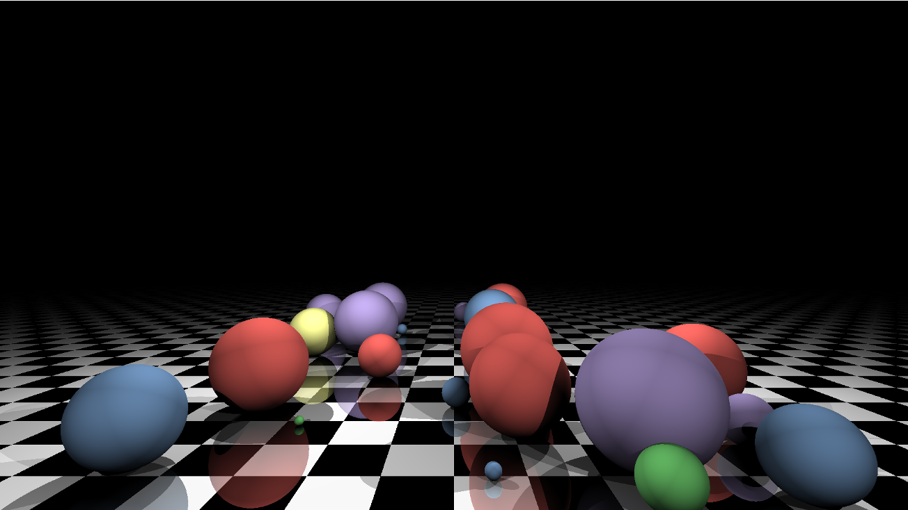

# Raytracer

A relatively simple ray tracer utilising Haskell's parallelization strategies to render simple scenes composed of planes and spheres, and use all CPU cores while doing so.



# Building

This is a stack project. Use the provided [Makefile](./Makefile) or run

```shell
stack build
```

# Running

The program comes with it's own scene description language. To render an image, you must first create some scene description files and then run the program with their paths as arguments. There is no documentation on the grammar – see [examples](./scenes) for reference.

From the top level directory, you can execute the program like this:

```shell
stack exec -- Raytracer <scene file path>
```

For development purposes, the included [Makefile](./Makefile) defines some rules that build and run the project. Some of these rules require other programs to be in your PATH:

- make scenes – renders all examples in the [scenes](./scenes) folder
- make bench – renders a scene and uses the `time` utility to show how much CPU is used (requires `zsh`)
- make threadscope – renders a scene and show how well the rendering process was parallelized (requires `threadscope`)
- make memory – renders a scene and shows the program's memory usage as a function of time (requires `hp2pretty`)
- make profiteur – renders a scene and shows profiling information<sup>\*</sup> in a nice webpage format (requires `profiteur`)
- make docs – builds the Haddock documentation
- make clean - clears the workspace of junk

<sup>\*</sup> – this rule uses the `open` command native to macOS. If you are using some other OS, you will need to open the generated `.prof.html` file manually.

# Caveats

This project deliberately does not utilize the GPU for rendering. That's why, for performeance reasons, point light sources in this program are indeed points, that is, they have no surface area. To create realistic shading effects, the Phong reflection model is used wherever the ray intersects with a surface.

# Documentation

Haddock documentation can be generated by running `make docs` in the main directory.
